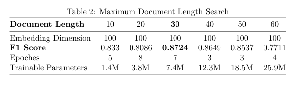
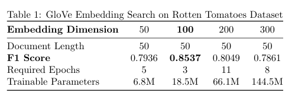
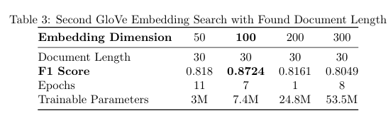
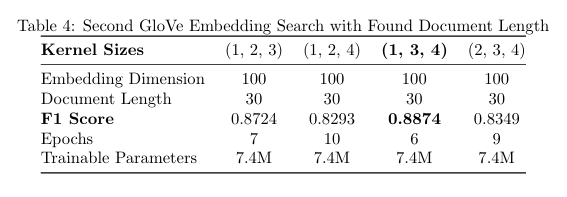
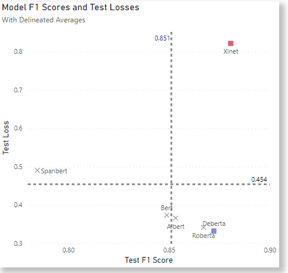
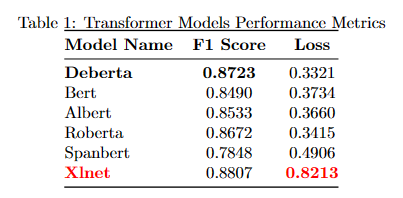

## Project Overview
This serves as the student's first deliberate practice over the various methods available to them under the domain of Machine Learning for sentiment analysis. These include Classical Machine Learning Techniques (specifically regressions, trees, ensembles, boosting, and support vector machines (SVMs), Neural Networks with Semantic Embeddings, and finally, transformers.  

## Problem Definition and Literature Search
The `rotten_tomatoes` dataset was originally formulated by [Pang and Lee (2005)](https://arxiv.org/pdf/cs/0506075.pdf) where they wanted to infer a rating based on the proportion of positive sentences within a given review by a specific author. In order to do so, they needed a dataset that contained sentences that were fragemented off from the entirety of the review and `rotten_tomatoes` is the product of their initial work. These labels were procedurally generated based on removing a set of stop words and the sentiments {0: negative, 1: positive} were inferred from the rating of the review. Afterwards, they were fitted to a Naieve Bayes model and propogated used to predict the sentiments of the rest of their review data. The original data can be found [here](https://www.cs.cornell.edu/people/pabo/movie-review-data/). 

The goal of this project is to search methods in predicting sentiments that are superior to a Naieve-Bayes classifier. When searching for additional supplementary literature, it was recommended [here](https://www.cs.cornell.edu/people/pabo/movie-review-data/otherexperiments.html) to search for articles that included the terms `movie-review-data`. In addition, Google Scholar searches were conducted with the explict filtering for papers that cited Pang and Lee's (2005) paper.

Under these filters, [this paper by Georgios Liachoudis](http://arno.uvt.nl/show.cgi?fid=156527) shows what is possible with Classical Machine Learning techniques like RandomForest, XGBoost, Logistic Regression, Support Vector Machines, Multinomial Machine Bayes, and K-Nearest Neighbors with two different vectorizations of the Bag of Words representation of documents. Early attempts at optimizing specific machine learning techniques replicate findings in this paper.

Then, for Classical Machine Learning, what will be shown is a custom ensemble classifier comprising of techniques shown in Liachoudis (2020).

### Static Word Embedding Approaches

In addition to implementing classical Machine Learning approaches, we were informed of some of the drawbacks that classical machine learning has yet to surmount. The way that these methods vectorize our documents does not take into account the order of the words and treat them all equally irrespective of their meaning or function. Most importantly, the cultural meaning of words is ignored.

Solutions to these problems come twofold: the first being **language models** that attempt to represent words in their most familiar connotations in the context relevant to the task at hand; the second coming in the form of adjusting the meaning of words based on its placement through **mixing models**.

[Luo et. al. (2022)](https://www.sciencedirect.com/science/article/pii/S2352864822001900#fig6) decomposes this process even furhter by trying to represent the meaning of words to a machine on the local level and the global level while also importing the Classical Machine Learning approach of weighting word representations by their importance. The importance of this paper will be expanded on in the section about the Static Embedding Representations for words.

### Fine-Tuning Transformers

For the capstone to this project, we began to work with fine-tuning Transformer models. The transformer architecture was discussed during the course of the subject and form the basis of all models used, the discussion of which is beyond the scope of this task. Rather, it was given a priori at the professor's suggestion that DeBERTA ([He et al. 2021](https://arxiv.org/pdf/2006.03654.pdf?trk=public_post_comment-text)) which *disentangles* the token and position embeddings where the latter aren't usually fine-tuned and are usually added together after the former already are. In keeping two copies of query, key, and value vectors with respect to the content and position of a token enables the learning of a token *relative* the other constiuents of a document. 

This benefit is shown in its results on the General Language Understanding Evaluation (GLUE) Benchmark. In an experiment conducted in the same paper ([He et al. 2021](https://arxiv.org/pdf/2006.03654.pdf?trk=public_post_comment-text)) on contemporary state of the art models on the large versions of BERT, RoBERTA, XLNET, ELECTRA, and their own DeBERTa, on average it performed 1.93% better than the others with a score of 90. 

What was peculiar upon a cursory review of the paper's tables was the slight outperformance of [XLNET](https://arxiv.org/abs/1906.08237) on Standford Sentiment Treebank Bank 2 (SST-2) with a f1-score of 97.0 with DeBERTa's 96.8. It should be noted that this task focuses on the classification of movie review data, and as such, deigned its results to be extreme relevant to the task at hand. In seeing such a result, I had made the choice of including [XLNET](https://arxiv.org/abs/1906.08237), amongst the other pre-trained transformers shown in class that were recommended to be adequate for a Natural Language Understanding (NLU) task such as BERT, RoBERTa, SpanBERT, AlBERT and DeBERTA.

### Datasets
Originally, this would only span the [rotten tomatoes dataset](https://huggingface.co/datasets/rotten_tomatoes) but over the course of development, it was shown to be useful in Liachoudis (2020) to include additional data of a similar source. The most readily available was the pre-labed dataset of [imdb reviews](https://huggingface.co/datasets/imdb). While separated into `train` and `test` splits, in `main.py` they end up being combined and folded into `rotten_tomatoes_train`. 

## Classical Machine Learning

For classical machine learning approaches, I replicate Liachoudis (2020)'s techniques of RandomForest, XGBOOST, KNN, SGDClassifier, and NaieveBayes along with alternating between a Term Frequency Inverse Document Frequency vector representation of documents. In addition, I create my own voting classifier object that will now be discussed.

### CustomEnsemble Class

The final model proposes a custom voting ensemble consisting of two Multinomial Naieve Bayes Classifiers and one Stochastic Gradient Descent Classifier, each with different initialized alphas. Hyperparmater searches found that under this configuration, the best performing loss function for the `SGDClassifier` would be `log_loss`, indicating a partially linear feature space. 

```python
class CustomEnsemble(BaseEstimator, ClassifierMixin):
    def __init__(self, alpha_nb1, alpha_nb2, alpha_sgd, weight_nb1, weight_nb2, weight_sgd):
        self.alpha_nb1 = alpha_nb1
        self.alpha_nb2 = alpha_nb2
        self.alpha_sgd = alpha_sgd
        self.weight_nb1 = weight_nb1
        self.weight_nb2 = weight_nb2
        self.weight_sgd = weight_sgd
        self.nb1 = MultinomialNB(alpha=self.alpha_nb1)
        self.nb2 = MultinomialNB(alpha=self.alpha_nb2)
        self.sgd = SGDClassifier(alpha=self.alpha_sgd, loss='log_loss')
```

Each of these models are fitted (see `CustomEnsemble.fit()`) and their predicitons are aggregated by a weight hyperparamter assigned to each constituent of the voting classifier.

```python
# ... definied within the CustomEnsembleClass.
    def predict(self, X):
        nb1_pred = self.nb1.predict_proba(X) * self.weight_nb1
        nb2_pred = self.nb2.predict_proba(X) * self.weight_nb2
        sgd_pred = self.sgd.predict_proba(X) * self.weight_sgd

        # Sum and then normalize to get weighted average
        total_weight = self.weight_nb1 + self.weight_nb2 + self.weight_sgd
        avg_pred = (nb1_pred + nb2_pred + sgd_pred) / total_weight
        return np.argmax(avg_pred, axis=1)
```
#### Hyperparameter Search

Searches were conducted using Optuna and consisted of selecting a preprocessor, a vectorizer, and a classifier. 

The Preprocessor step consisted of a `LinguisticPreprocessor` object that was shown in class and refactored with the assistance of a Large-Language Model (LLM). See `main.py` for changes.

```python
def objective(trial):
    ... # Selection of Models conducted above.

    pipeline_steps = [
        ('preprocessor', LinguisticPreprocessor(
            do_lemmatize=trial.suggest_categorical('do_lemmatize', [True, False]),
            remove_html=trial.suggest_categorical('remove_html', [True, False])
        )),
        ('vectorizer', None),
        ('classifier', None)
    ]

```


The Vectorizer step includes logic that alternates between a `CountVectorizer` and a `TfidfVectorizer` object.


```python


    pipeline = Pipeline(steps=pipeline_steps)

    # Both contain parameters concerning n-grams.
    n_gram_min = trial.suggest_int('n_gram_min', 1, 3)
    if n_gram_min == 1:
      n_gram_max = trial.suggest_int('n_gram_max', 1, 3)
    if n_gram_min == 2:
      n_gram_max = trial.suggest_int('n_gram_max', 2, 3)
    if n_gram_min == 3:
      n_gram_max = trial.suggest_int('n_gram_max', 3, 3)

    if vectorizer_type == 'bow':
      pipeline.set_params(vectorizer=CountVectorizer(
          max_df=trial.suggest_float('bow_max_df', 0.7, 1.0),
          min_df=trial.suggest_int('bow_min_df', 1, 5),
          ngram_range=(n_gram_min, n_gram_max)
      ))
    elif vectorizer_type == 'tfidf':
      pipeline.set_params(vectorizer=TfidfVectorizer(
            max_df=trial.suggest_float('tfidf_max_df', 0.7, 1.0),
            min_df=trial.suggest_int('tfidf_min_df', 1, 5),
            ngram_range=(n_gram_min, n_gram_max)
        ))
```

Studies were conducted sequentially, meaning that the classifer stage was changed each time. This was to be run on Google Collab with an allowance of 1000 trials being run, only stopping if there wasn't an improvement by 0.2e-4 in 20 trials. Below are the results of the Optuna studies. 


#### Table of Results (Train + Cross Validation)
| Model         | Parameters                                                                                                             | Best Trial F1-Score |
|---------------|------------------------------------------------------------------------------------------------------------------------|------------------|
| CustomEnsemble| vectorizer: tfidf, lemmatize: False, remove_html: False, n_gram: 1-3, tfidf_max_df: 0.969, alpha_sgd: 1.39e-06, ...    | 0.8807           |
| SGD Classifier| vectorizer: tfidf, lemmatize: False, remove_html: False, n_gram: 1-2, tfidf_max_df: 0.871, sgd_alpha: 2.20e-05, ...     | 0.8751           |
| NaiveBayes    | vectorizer: tfidf, lemmatize: False, remove_html: False, n_gram: 2-3, tfidf_max_df: 0.926, nb_alpha: 0.211, ...         | 0.8623           |
| RandomForest  | vectorizer: bow, lemmatize: False, remove_html: False, remove_numbers: True, n_gram: 1-3, bow_max_df: 0.926, ...       | 0.8001           |
| XGBOOST       | vectorizer: bow, lemmatize: True, remove_html: False, n_gram: 1-2, bow_max_df: 0.848, xgb_max_depth: 5, ...            | 0.7016           |
| KNN           | vectorizer: bow, lemmatize: True, remove_html: False, remove_numbers: True, n_gram: 2-2, bow_max_df: 0.888, ...        | 0.5548           |

## Static Word Embeddings


#### Word Embeddings

As mentioned in the introduction, [Luo et. al. (2022)](https://www.sciencedirect.com/science/article/pii/S2352864822001900#fig6) created the architecture that will be replicated here, with some slight modifications. The principle being the changing of the language model from a Bidirectional Encoder Representations from Transformers (BERT) that would generate word embeddings tailored to our documents to [Pennington et. al. (2014)'s Globalized Vectors (GloVe)](https://nlp.stanford.edu/projects/glove/). What was used was the smallest file available, their representation of 6B Tokens, with a 400k vocab with choices between 50, 100, 200, and 300 embedding dimensions over Wikipedia and Gigaword 5.

While it may be more approiate for movie reviews to select other files to be the basis of our word embeddings, specifically their model based on tweets from Twitter, the decision to stick to the file mentioned above was on the basis of loading time when training and constructing the model. If given more time, a more throughough investigation of alternative language models in GloVe, and those beyond like FastText or word2vec are advised. 

#### Statistical and Semantic Representation of Words

[Luo et. al. (2022)](https://www.sciencedirect.com/science/article/pii/S2352864822001900#fig6) constructed their model with the intention of concatenating a set of embeddings weighted by a token's TF-IDF value along with semantic information on both a local and global level found by two mixing models: a Gated Recurrent Unit (GRU) that would mix the current embedding with embeddings found within the entire document and a Convolutional Layer with Maxpooling and a Flattening layer. Luo et. al. justifies this by claiming that mixing embeddings over different sets of kernels produces a set of features that would extract the most influential n-grams within a document and said features would surface after the pooling was conducted.

Each of these mixing models would be sent to a simple feed forward network, the dimensions of which are not specified in the paper, that would coerce the inputs to a set of 100 dimension vectors that would added together and ultimately concatenated with the weighted embeddings. The researches of that paper have the effect of output in the semantic representation's dimension over a myriad of datasets, the `rotten-tomatoes` dataset included. And for that dataset, a dimension of 100 had the highest accuracy score. Therefore, a priori, a set of two single-layer neural networks will coerce the outputs from the two different parts of the semantic branch and be added together. 

The summation and concatenation of these semantic features was selected due to the researches of Luo et. al. (2022) testing out different methods such as leaving the word embeddings unweighted, or concatenating both outputs from the GRU and ConvNet without summing them. It was found that their summation had the highest accuracy score and will be used in the development of this model.

Afterwards, the concatenated output would be put through a feed-forward network with a binary classification head. 

### Python Implementation

[Pytorch](https://arxiv.org/abs/1912.01703) was used to construct this neural network using Object Oriented Programming. Pytorch lightning's `Trainer` class was adapted to effectively have our model learn the patterns of our data and maximize the Macro F1 score. 

### Preprocessing

Classes
1. RTDataset
2. Preprocessor
3. StatisticalPreprocessor
4. SemanticPreprocessor

#### `RTDataset(split (str): {'train', 'validation', 'test'})`
- Uses huggingface's `load_dataset` module to extract one of the splits specified. Inherits from `torch.utils.data.Dataset`.

#### `Preprocessor(max_length: int, embed_dim: int)`
  - Loads an instance of torch.text.vocab.vocab_module.GloVe with the given parameters.
  - Also contains information about the maxmium word length and perofrms padding based on that information.
  - [Luo et. al. (2022)](https://www.sciencedirect.com/science/article/pii/S2352864822001900#fig6) suggests that preprocessing take in the form of removing stop words, punctuation, and fucntional words like prepositions and transitions. The set included in the code was created using Generative AI (ChatGPT).

  - Methods
      - preprocess_text - Tokenizes and filters out punctuation, stop words, and functional words.
      - word_to_indices - Coerces words to GloVe index.
      - pad_or_truncate - Adds padding or cuts off document to conform to `len(doc) = max_length`.
  - Returns
    - tuple: Tuple containing indices, input data (X), and labels (Y).

#### `StatisticalPreprocessor(glove: vocab_module.vectors.GloVe)`
  - Ranks importance of word based on prevalnce in other documents using TF-IDF matrix formed out of batch. NOTE: There was a consideration of first conforming the entire dataset to a TF-IDF matrix and then calling that within this dataset but was ultimately not implemented due to time constraints. 
  
  - Methods
    - tfidf_representation - Returns weights by combining `CountVectorizer` and `TfidfTransformer` from `scikit-learn`. `TfidfVectorizer` was not compatible due to the steps necessary for preprocessing being already conducted in the `Preprocessor` class. The combination of those two objects is the equivalent of the third according to their documentation.
    - word_embedding_representation - Returns word embeddings looked up by GloVe Index (numerical token.)
    - factor - Multiplies output from `word_embedding_representation` by scalar found in `tfidf_representation`.
  
  - Returns
    - torch.Tensor (expected size of (batch_size, max_len, embed_dim))

#### `SemanticPreprocessor(glove: vocab_module.vectors.GloVe)`
  - Simply returns the word embedding given the word index from GloVe's vocabulary.

  - Methods
    - word_embedd_representation
  - Returns
    - torch.Tensor (expected size of (batch_size, max_len, embed_dim))

### Network Architecture

FusionNet
  - Divergent Branches
    1. Statistics Branch
      - StatisticalPreprocessor (instance)
    2. Semantics Branch
      - SemanticPreprocessor (instance)
      - SemanticNet
        - LocalSemanticNet
        - OverAllSemanticNet

  - Convergent Branch
    1. FullyConnectedNet

#### `FusionNet(semantics: SemanticPreprocessor, statistics: StatisticalPreprocessor, learning_rate=1e-3, embed_dim=100, doc_len=50, local_out_size=96, local_kernels=(1, 2,3), overall_out_size=128, overall_bidirectionality=True, out_dim=100)`

- Provides all relevant parameeters for its constituent branches. Orchestrates the full flow of data for this project. Default parameters are the ones found by [Luo et. al. (2022)](https://www.sciencedirect.com/science/article/pii/S2352864822001900#fig6).

- Attributes
  - self.validation_step_outputs - Container for validation loss of a batch. Averaged later to find the validation loss.
  - self.test_step_output - Container for index and predictions for requested output to `results.csv`.
  - self.loss_fn - Instance of torch.nn.BCELoss() -> Binary Cross Entropy suggested by Generative AI for Binary Classification Problems. 
  - self.tp - Running count of true positives. Resets every validation epoch.
  - self.fp - Running count of false positives. Resets every validation epoch.
  - self.fn - Running count of false negatives. Resets every validation epoch.

- Methods
  - semantics_branch
  - statistics_branch
  - forward
    
   ```python
    def forward(self, x):

        semantics_output = self.semantics_branch(x)
        statistics_output = self.statistics_branch(x)
        statistics_output = statistics_output.view(statistics_output.size(0), -1)

        x = torch.cat((semantics_output, statistics_output), dim=1)
        x = x.view(x.size(0), -1)

        x = self.fc_net(x)
        return x
    ```

    Sends data to each of the intalized branches and performs the concatenation as suggested by Luo et. al. `self.fc_net` is an instance of the `FullyConnectedNetClass`. 

  - calculate_f1_score_from_counts
  - training_step
  - validation_step
  - on_validation_epoch_end -> Reports F1 Score and Loss.
  - test_step
  - on_test_epcoh_end -> Reports results by posting to `results.csv` and then re-opening and sorting the file by index, and then adding a header.
  - configure_optimizers -> Instantiates Adam optimizer. Alternative optimizers used in development, will be discussed in findings.

##### Statistics Branch
See `StatisticalPreprocessor`. Ultimately calling `forward` function.

##### Semantics Branch
First sending data through `SemanticPreprocessor` that just sends the vocab index in and returns the word embedding. 

`SemanticNet(embed_dim, doc_len, local_out_size, local_kernels overall_out_size, overall_bidirectionality_ out_dim)`
- Composes together LocalSemanticNet and OverallSemanticNet upon intalization.

- Methods
  - Forward - > Sums the outputs from the two branches.
  ```python
      def forward(self, x):
        local_output = self.local(x)
        overall_output = self.overall(x)

        combined_output = local_output + overall_output  # Element-wise addition

        return combined_output
  ```

  `LocalSemanticNet(embed_dim, doc_len, out_channels, kernel_sizes, out_dim)`-> Ultimately builds upon what was suggested by the researches in Luo et. al. This model creates different instances of convolutions based on the kernel sizes imputed and then has each of the resulting matrices maximally pooled togehte rwith their neighbouring embedding. It was under the professor's critique that a batch normalization at this stage would be suggested. Finally, the result is reformated for being sent through a single feed-forward layer.
  ```python
      def __init__(self, embed_dim=100, doc_len=50, out_channels=96, kernel_sizes=(1, 2, 3), out_dim=100):
        super(LocalSemanticNet, self).__init__()
        self.convs = nn.ModuleList([nn.Conv1d(in_channels=embed_dim, out_channels=out_channels, kernel_size=k) for k in kernel_sizes])
        self.maxpools = nn.ModuleList([nn.MaxPool1d(kernel_size=2) for _ in kernel_sizes])
        self.conv_batch_norms = nn.ModuleList([nn.BatchNorm1d(out_channels) for _ in kernel_sizes])
        
        input_size = int(sum([(math.floor((doc_len - k + 1) / 2)) * out_channels for k in kernel_sizes]))

        self.fc = nn.Linear(input_size, out_dim)
        self.relu = nn.ReLU()

      def forward(self, x):

        pooled_feature_maps = []
        x = x.permute(0, 2, 1)  # Transforms into (batch_size, embed_dim, doc_len)

        for conv, maxpool, bn in zip(self.convs, self.maxpools, self.conv_batch_norms):
            feature_map = conv(x)
            feature_map = bn(feature_map)  # Apply batch normalization
            pooled_feature_map = maxpool(F.relu(feature_map))  # Apply ReLU after batch normalization
            pooled_feature_maps.append(pooled_feature_map)

        flattened = [i.view(i.size(0), -1) for i in tuple(pooled_feature_maps)]
        x = torch.cat(flattened, dim=1)
        x = self.fc(x)
        x = self.relu(x)

        return x

  ```
  `OverallSemanticNet(embed_dim, doc_len, out_size, bidirectionality, out_dim)` -> Connects input data to a GRU and the finally a feed forward network based on the proportions imputed by the FusionNet. 


  ```python
  class OverallSemanticNet(pl.LightningModule):
      def __init__(self, embed_dim=100, doc_len=50, out_size=128, bidirectionality=True, out_dim=100):

          super(OverallSemanticNet, self).__init__()

          self.gru = nn.GRU(embed_dim, out_size, bidirectional=bidirectionality)

          if bidirectionality:
              self.fc = nn.Linear(out_size * doc_len * 2, out_dim)
          else:
              self.fc = nn.Linear(out_size * doc_len, out_dim)

          self.relu = nn.ReLU()

      def forward(self, x):
          x, _ = self.gru(x)
          x = x.view(x.size(0), -1)
          x = self.fc(x)
          x = self.relu(x)

          return x
  ```

### Training Specifics

- Methods
  - `collate_and_transfer_to_device(preprocessor, device)` -> Takes in a batch from a DataLoader and extracts their index, document, and label.

- Callbacks
  - `early_stopping` -> Constructed based on val_f1. Stops training when no improvement occurs for 5 epcohs.
  - `checkpoint` -> Constructed based on val_f2. Saves model when val_f1 increases. 

- Seed
  - Set to 42 for replication. 

### Optimization
- Learning_rate
  - Learning rate suggested by Luo et. al. to be .001. PyTorch Lightning's `Tuner` class contains a method called `auto_lr_find`. However, upon investigation, it was said that our dataset was too small and the loss values of our validation set converged too soon for any search to be impactful. 
- Optimizer
  - Adam was originally implemented. Adafactor was attempted but did not yield any f1 result higher than .50 within 5 epoches. However this finding is not robust. Given more time, perhaps it would be best to explore different optimizers to see our model converge faster. However, given our low epoch count, searching and implementing optimizers was seen as a secondary conern.

### Hyperparameter Sensitivity

- Document Length: It was taken for granted, based off Luo et. al. that the ideal cut-off point for documents would be 50 words. However, given that there was time alloted, an investigation was conducted to see whether or not thisw as the case. Seen in Table 2, for this dataset and with pretrained GloVe vectors, it appears that it would be better to cut even more information off and only have documents of length 30. 

<center>



</center>

- Word Embedding: It was found that the amount of space taken up by our semantic vectors affected the outcome of the Macro F1 Score on the testing dataset. Search was consistent with findings in Luo et. al. that an embedding dimension of 100 would provide the best results as seen in Table 1.
<center>






</center>

  Note how the parameter size varies with the number of embedding dimensions. Perhaps the loss in statistical power could be attributed to a FullyConnnected architecture that simply decreases in complexity. This failure to learn as fast as possible is evident in how higher dimensional models require double the training time than the optimal dimensionality. 

- Kernel Sizes: A priori, it was accepted that kernel sizes of (1, 2, 3) should be used, capturing the single token, bigrams, and trigrams. However, an investigation into whether or not it would be efficacous for our dataset yielded a result that indicated that trigrams and fourgrams should be used.

<center>



</center>

## Fine Tuned Transformers

### Parameter Definition

#### Hyperparameter Search

These six models were then optimized using the professor's hyperparameter-searching tool [AutoTransformers](https://github.com/lenguajenatural-ai/autotransformers/tree/master) over the base models and the pre-defined base hyperparameter space which when called within the package as `hp_space_base` returns a parameter space as follows:

```python
def hp_space_base(trial):
    """Hyperparameter space in Optuna format for base-sized models (e.g. bert-base)."""
    return {
        "learning_rate": trial.suggest_float("learning_rate", 1e-5, 7e-5, log=True),
        "num_train_epochs": trial.suggest_categorical(
            "num_train_epochs", [3, 5, 7, 10, 15, 20, 30]
        ),
        "per_device_train_batch_size": trial.suggest_categorical(
            "per_device_train_batch_size", [8, 16]
        ),
        "per_device_eval_batch_size": trial.suggest_categorical(
            "per_device_eval_batch_size", [32]
        ),
        "gradient_accumulation_steps": trial.suggest_categorical(
            "gradient_accumulation_steps", [1, 2, 3, 4]
        ),
        "warmup_ratio": trial.suggest_float("warmup_ratio", 0.01, 0.10, log=True),
        "weight_decay": trial.suggest_float("weight_decay", 1e-10, 0.3, log=True),
        "adam_epsilon": trial.suggest_float("adam_epsilon", 1e-10, 1e-6, log=True),
    }
```

The concept of gradient accumulation was introduce to us in order to manage the computing resources of our compute. In this instance, a Google Collab environment was used with a V100 GPU under a Collab Pro subscription. This piece of hardware boasts 16GB of RAM which necesitated decreasing the batch size during training (from 32 in the static word embedding task to either 8 or 16). The results of which will be discussed in-depth in the implementation section. 

The result of such yielded these results for the selected model DeBERTA-v3-base:

```python
hp_space_results = {
    "learning_rate": 1.132933165272574e-05,
    "num_train_epochs": 7,
    "per_device_train_batch_size": 16,
    "per_device_eval_batch_size": 32,
    "gradient_accumulation_steps": 2,
    "warmup_ratio": 0.04751388086243615,
    "weight_decay": 3.47814371740729e-08,
    "adam_epsilon": 1.0084904907887147e-08
}
```

#### Max Document Length

The `tokenize_function` function is used to convert documents within the `rotten_tomatoes` daatset into a format amenable to how DeBERTa has been set up. It takes from the dataset and uses HuggingFace's own tokenizer which is instantiated within the `autotrainer` class (of which itself has been instantiated) before the `main` function. The selected `max_length` for this model was found [here](https://huggingface.co/microsoft/deberta-v3-base/blob/main/config.json).

```python
def tokenize_function(examples):
    """
    Tokenizes the text examples using the tokenizer from the AutoTrainer instance.

    This function is intended to be used with the `map` method of a Hugging Face dataset. 
    It tokenizes the text, adds padding to the maximum length specified, and ensures that 
    the tokenization is truncated to the max length if it exceeds it.

    Parameters:
    - examples (dict): A dictionary containing the texts to be tokenized, with the key "text"
      pointing to a list of string texts.

    Returns:
    - dict: A dictionary with the tokenized inputs suitable for input to a model. The keys of the
      dictionary correspond to the model's expected input names.
    """
    return autotrainer.tokenizer(examples["text"], padding="max_length", truncation=True, max_length=512)
```

#### Floating Point Representations (fp16 vs. fp32)

In addition, it was recommended that operations within the cloud computing GPU occur during training with floating point numbers being represented with 16 bits (fp16=True) rather than as 32 bits. This decreased the computational load on it while granting the benefit of lower overhead needing to be maintained in memory and a swifter training time.

### `Main` Function

```python
def main():

  """
  Main function to execute the training and prediction process using the AutoTrainer.

  This function runs the AutoTrainer with the configuration set for the Deberta-v3 model
  and the Rotten Tomatoes dataset. After training, it performs prediction on the test set,
  calculates the f1-score, and saves the prediction results to a CSV file.

  The predictions are saved in a file named 'results.csv', with two columns: 'index' for the
  example index in the test set, and 'pred' for the predicted label (1s and 0s).
    
  Outputs are printed to the console, including the f1-score achieved on the test set and
  the path to the saved CSV file with predictions.
  """
  # Train the model.
  _ = autotrainer()

  # Gather the results
  results = autotrainer.trainer.predict(test)

  print(f"The resulting f1-score is {round(results.metrics['test_f1-score'], 3)}")

  df = pd.DataFrame({
      'index': np.arange(len(results.label_ids)),
      'pred': results.label_ids
  })

  csv_path = 'results.csv'

  df.to_csv(csv_path, index=False)

  print(f"Predictions saved to {csv_path}")
```

The main point of this script is to run the autotrainer with the model and dataset configurations already set. Autotrainer has a model already prepared but doesn't carry copies of the rotten_tomatoes dataset within its class. Hence the need for loading a test dataset outside this function beforehand and running the test results from there.

### Results

<center>



</center>

<center>



</center>

In seeing and visualizing the results based on the f1 score on the test dataset and the loss function that it entailed, we can see the BERT performed on average better than the other competing models besides XLNET, which was expected based on what was found in the literature review. However, XLNET's success comes at the cost of it overfitting more, at least compared with the other models tested.

## Conclusions

### Classical Machine Learning Approaches
This project set out to explore various machine learning techniques for sentiment analysis on the rotten_tomatoes dataset, with the aim of surpassing the performance of a Naive Bayes classifier as established by Pang and Lee (2005). The findings indicate that, when evaluating a training dataset with CrossValidation, that the proposed model `CustomEnsemble` has the highest Macro F1 of 0.8807. This suggests that an ensemble method can augment the predictive capabilities of machine learning methods in sentiment analysis.

Preprocessing steps like lemmatization and HTML tag removal were shown not to contribute to better performance over the provided dataset. Which helped address one of the potential challenges of this task, that being the computational cost. Searching for local optimas over large numbers of hyperparameters can be expensive. This was partially addressed by hosting these searches on GoogleCollab with a Pro subscription, which allowed five virtual machine instances to run at the same time. 

### Static Word Embedding Approaches

Luo et al. (2022) emphasizes the importance of considering both statistical and semantic representations of words, as well as the architectural design choices in constructing a neural network for text classification tasks. Based on discussion over the limitations of classical machine learning approaches, static word embeddings serve a pivotal role teaching machines to interpret order and relative meaning.

Borrowing their FusionNet architecture, deviations found when replacing the word embeddings from BERT to GloVe required that changes be made to suit the data at hand. The architecture is particularly sensitive to document lenth, embedding dimension, and the kernel size of the convolutional component. Attempts were made to look into learning rates, batch sizes, and a different method of optimization to no avail.

### Fine Tuned Transformers

This experiment focused on sentiment analysis utilizing a range of preeminent models. In the literature review, the performance metrics indicate DeBERTa performs the best over all in the GLUE Benchmark with XLNET performing comparitively better in the realm of sentiment analysis, and while such results have been replicated here during the fine tuning of transformers, a new lens could be added that contributed to the preference of DEBERTA over XLNET in the final submission, owing the XLNET's lack of generalizability at a low performance enhancement.

